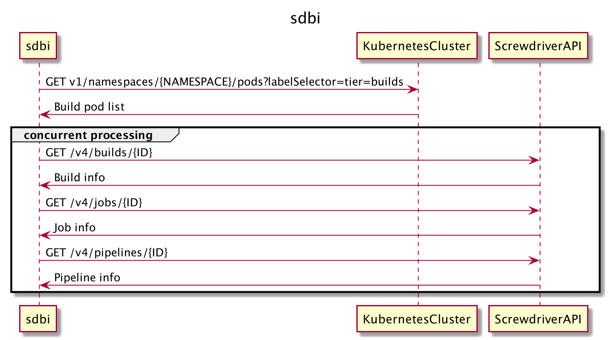

# sdbi
## Change Log
- 30/04/2020 delete -all option from `config current` and `config view`
- 21/08/2020 update -a option from `config set`
- 21/08/2020 delete `config current` sub command
- 12/09/2020 delete `-n` option from get command
- 12/09/2020 update `-u` option from config create and config set

## Proposal
```bash
sdbi get node01 node02                          # Get information about the build running on node01 and node02.
sdbi get -i "123456-podname 78901-podname"      # Get information about the build id 123456 and 78901.
echo "123456-poname 78901-podname" | sdbi get   # Get information about the build id 123456 and 78901. (stdin version)

sdbi config create TestConfig https://api.screwdriver UserToken   # Create a configuration named "TestConfig".
sdbi config delete SampleConfig                                   # Remove the configuration named "SampleConfig".
sdbi config use TestConfig                                        # Set the configuration named "TestConfig" to the current configuration.
sdbi config set TestConfig --api-url https://api.sd               # Changes the configuration of the specified name.
sdbi config view                                                  # View the all config.
```

## Details


## Usage
### Requires
- You need a kubectl config that can be connected to the Screwdriver cluster.

### Get build info
`sdbi get`
#### options 
- `-i` or `--id`
#### output
```
Org/Repo    JobName     Build URL
dummy/yummy fast-eating https:/cd.screwdriver.com/builds/01
...
```

### Configuration
#### Create sub command
`sdbi config create [ConfigName] [APIURL] [UserToken] [UIURL]`
#### Delete sub command
`sdbi config delete [ConfigName]`
#### Use sub command
`sdbi config use [ConfigName]`
#### Set sub command
`sdbi config set [ConfigName]`
##### option
- `-a` or `--api-url`
- `-t` or `--token`
- `-u` or `--ui-url`
#### Current sub command
`sdbi config current`
##### output
```
ConfigName  API URL                         UserToken
TestConfig  https://api.cd.screwdriver.com  you_token
```
#### View sub command
`sdbi config view`
##### output
```
Current   ConfigName    Setting
      *   TestConfig    API URL:    https://api.cd.screwdriver.com
                        User Token: tekitounaatai
          SomeConfig    API URL:    https://api.cd.sd.com
                        User Token: detaramenaatai
```
